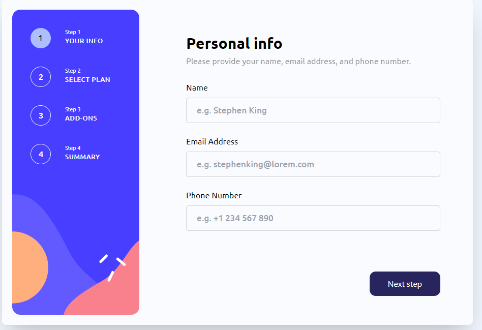

Welcome to my project! 🚀

 ## FEATURES 👨‍🍳

## USER-FRIENDLY NAVIGATION:

Step Indicator: Shows users their current position within the form and remaining steps.
Next and Previous Buttons: Allow users to easily move forward or backward through the form steps.
Sidebar Navigation: Provides an overview and quick navigation to different steps.


## Data VALIDATION AND FEEDBACK:

Real-Time Validation: Ensures that the entered data meets the required criteria before users can proceed to the next step.
Error Messages: Clearly highlight errors and guide users to correct them.

## PROGRESS SAVING:

Auto-Save: Automatically saves users' progress so they can return later without losing data.
Manual Save Option: Allows users to save their progress manually at any point.


## DYNAMIC CONTENTS:

Conditional Logic: Displays or hides fields based on users' previous answers.
Dynamic Pricing: Updates and displays costs based on users' selected options.


## VISUAL ENHANCEMENT 📱:

<!-- Responsive Design: Ensures that the form looks and works well on all devices (desktops, tablets, and smartphones). -->
Themed Design: Consistent styling that aligns with the overall website or application theme.
E Icons: Use visual cues like e icons to enhance user understanding and engagement.

## ACCESSIBILITY:

Keyboard Navigation: Allows users to navigate through the form using keyboard shortcuts.
Screen Reader Support: Ensures that the form is fully accessible to users with disabilities.

## SUMMARY AND CONFIRMATION:

Review Step: Provides a summary of all entered data for users to review before final submission.
Editable Summary: Users can edit their responses directly from the summary step.


=> ENHANCED INTERACTION:

Tooltips and Help Texts: Provide additional information or guidance on specific fields.
Animations and Transitions: Smooth transitions between steps for a better user experience.


# Process of Developing the Multi-Step Form ☁️

## Getting Started

The idea for the Multi-Step Form came from front-end mentor website and i just wanted to test and increase my knowlegde in html, tailwind css and javascript using react js.

## Initial Planning


### Design 


 **User Interface (UI) Design**:
    - The images of each step of both desktop and mobile view of the project where provided by front-end mentor

## Development

### Technologies Used

 **Frontend**:
    - React.js for building the user interface.
    - Tailwind CSS for styling the components.
    - PropTypes for type-checking.


### Implementation Steps

1. **Setting Up the Project**:
    - Initialized the project with vite.
    - Installed necessary dependencies: React, PropTypes, Tailwind CSS.

2. **Building the Components**:
    - Created individual components for each form step.
    - Implemented a sidebar for navigation.
    - Developed the step indicator to show current progress.

3. **State Management**:
    - Used React's `useState` hook to manage form data and current step.
    - Implemented functions to handle navigation between steps.

4. **Form Validation**:
    - Added validation for each step to ensure data integrity.
    - Provided real-time feedback to users on data entry errors.

### Challenges and Learning Experiences

1. **State Management**:
    - Managing the state across multiple steps was initially challenging.
    - Learned to effectively use React hooks to manage and pass state between components.

2. **Dynamic Content**:
    - Implementing conditional logic to show/hide fields based on user input required careful planning.
    - Gained a deeper understanding of React's re-rendering process.

3. **Styling**:
    - Hard a hard time in the  responsive design that i left it but i will try to do it later.
   


## Future Enhancements / Improvements ✨

1. **Backend Integration**:
    - Plan to integrate with a backend service for data submission and storage.

2. **Enhanced Validation**:
    - Implement more comprehensive validation rules and error handling.

3. **Progress Saving**:
    - Add functionality to save user progress and allow them to resume later.

4. **styling**:
  - Make the form responsive on each devices


## Running the Project 🚦

After cloning the repository, follow these steps to run the project locally.

### Prerequisites

Make sure you have the following installed on your machine:
- Node.js 
- npm 

### Installation

1. **Clone the repository**

   ```bash
   git clone https://github.com/yourusername/your-repository.git


2. **Navigate to the project directory**  

(cd MULTI-STEP-FORM)

3. **Installing dependencies and running the project**

install dependencies by running (npm install) on your terminal

run the project by running (npm run dev)


## Screenshot of the project




## Conclusion

The development of the Multi-Step Form was a rewarding experience. It provided valuable insights into user experience design, state management, and component-based architecture in React. The end result is a user-friendly, intuitive form that enhances the overall user experience.


## Final Thoughts

Developing this Multi-Step Form has significantly enhanced my understanding of React and frontend development. I am excited to continue improving this project and exploring new features.

Thank you for taking the time to read about the development process. Feel free to contribute or provide feedback!


